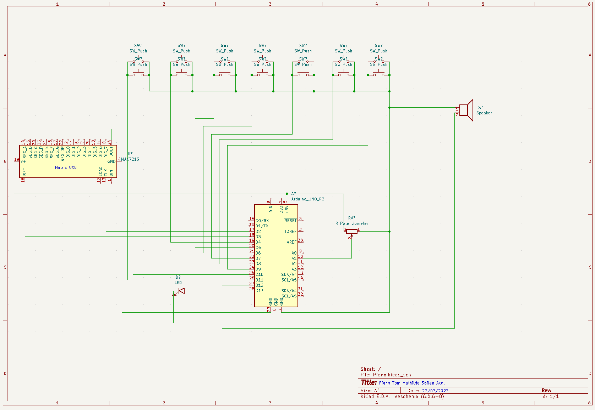

# Projet Piano - 22.07.22

[](http://forthebadge.com)  [](http://forthebadge.com)


## * Description Projet *
Nous sommes une équipe de 4 : 

```bash
Tom Brzezinski
```
```bash
Sofian Slimani
```
```bash
Axel Zidane
```
```bash
Mathilde Asselin
```
Nous avons réalisé un piano qui comporte 7 notes : "Do, Ré, Mi, Fa, Sol, La, Si".  
Sur le côté droit, grâce à notre potentiomètre on peut jouer sur 3 gammes : Grave, Neutre et Aigu.  
Sur le côté gauche on a un écran qui affiche les notes lorsqu'on joue. 

## * Schéma *



## * Photos & Vidéos fonctionnement *

Voici deux vidéos Youtube de présentation :

[](https://youtu.be/E45phyInUGs). . .
[](https://youtu.be/F53Q8GoYeoA)


## * Photo équipe *


## * Amélioration possible *
- Carte ESP32 
- Design avec imprimante 3D 

## * Liste matériel *

Pour la partie technique : 
- Platine d'expérimentation
- Carte Arduino
- Matrix LED MPX72 19
- Boutons poussoirs (x14)
- Câbles de liaison
- potentiometre b10K
- Haut parleur
- Alimentation externe 

Pour la partie design : 
- Carton 
- Cutter
- Pistolet à colle
- Peinture 
